# laravel-routines-admin

Admin panel for [`padosoft/laravel-routines`](https://github.com/padosoft/laravel-routines).
**React 19 · Vite 8 · Tailwind 4 · TanStack Query 5**, entirely on the API — no server-side state,
no Blade beyond the mount view.

```bash
composer require padosoft/laravel-routines-admin
php artisan vendor:publish --tag=routines-admin-config
```

The panel lives at `/admin/routines` (configurable) behind whichever guard you choose.

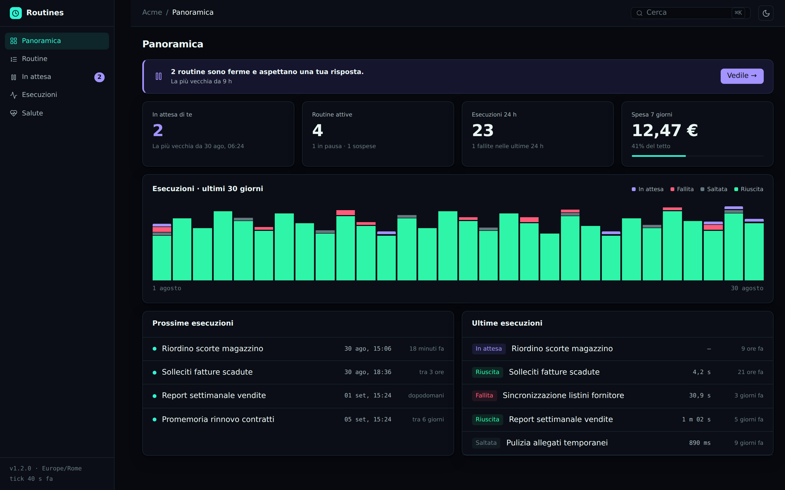

## What it contains

| Screen | What it is for |
|---|---|
| **Overview** | Is anything waiting on me? Is everything running? What happened? |
| **Routines** | List, guided creation, detail, schedule, mandate |
| **Awaiting you** | The stopped fires waiting on a human answer — the product's signature screen |
| **Runs** | The full ledger: outcome, reason, duration, cost, idempotency key |
| **Health** | Last tick, overdue routines, stuck locks, registered targets |

Guided creation shows a **preview of the next runs in the owner's timezone**, with the timezone
abbreviation and a note on daylight-saving transitions: it is the fastest way to notice that a time
is one timezone off, before the routine runs that way for a month.

### Awaiting you

The signature screen. A routine that stopped to ask for permission **has not failed**: it is doing
exactly what it was written to do. Which is why it appears in no error log and trips no monitor —
the only place it can be seen is here.


### Routines, detail and guided creation

| | |
|---|---|
| 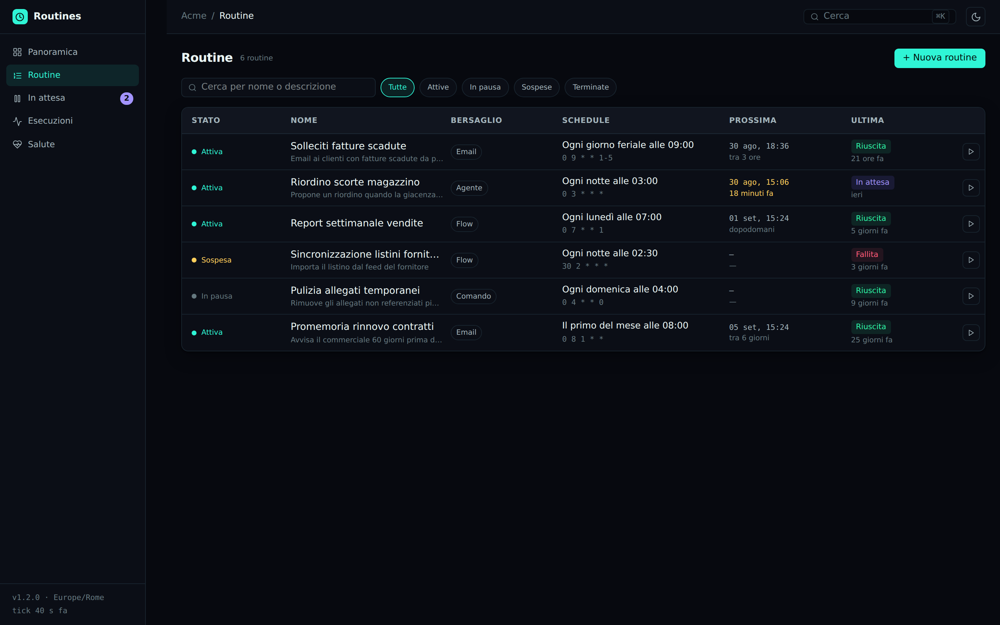 | 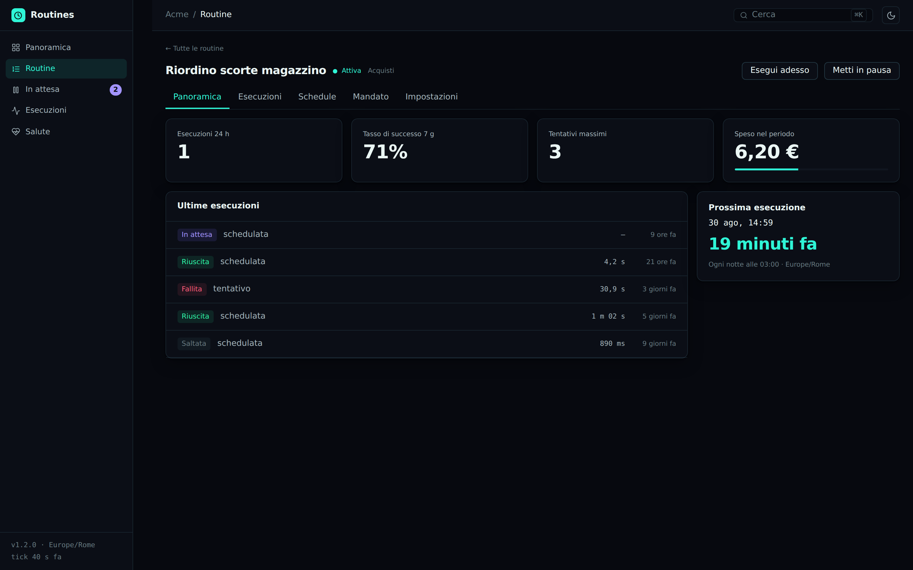 |
| The list: status, next run, outcome of the last one. | The detail, with the mandate and the next occurrences. |
| 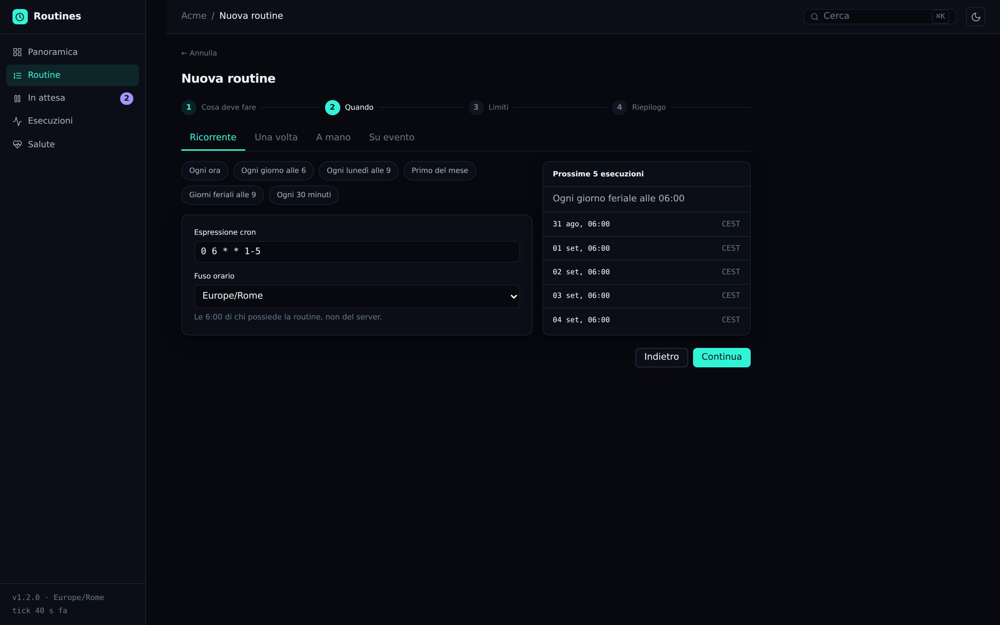 | 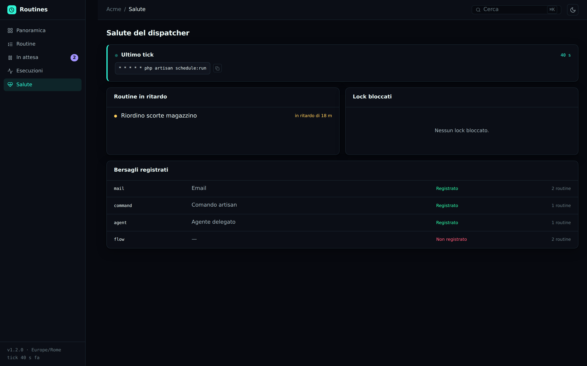 |
| The wizard shows **five real dates** before there is anything to save. | Last tick, overdue routines, registered targets. |

### The ledger and the light theme

| | |
|---|---|
| 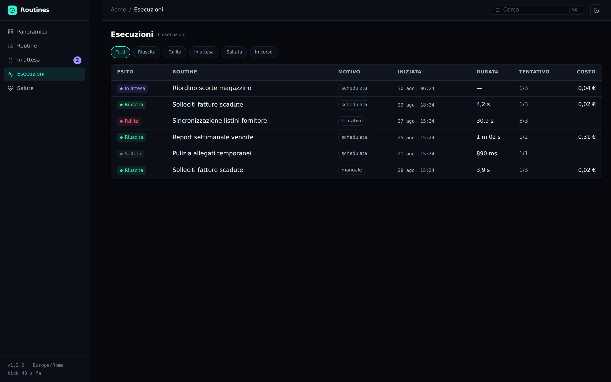 | 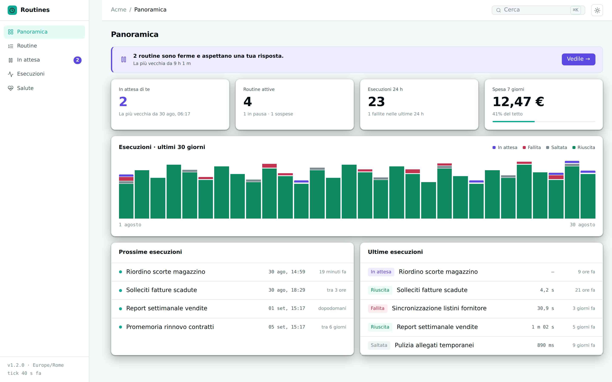 |
| Every fire: outcome, reason, duration, cost, idempotency key. | Light and dark carry equal weight; neither is the other's fallback. |

## The interface decisions that matter

A panel for automations is not judged on how good it looks full-screen, but on what happens in the
cases where something went wrong and nobody was watching. These are the choices made for those
cases, and each one has a test holding it in place.

**The "awaiting" banner at zero does not exist.** It is not replaced by a green "all good" box: a
box that is always there stops being read within a week, and the day it says 3 nobody looks at it.
Same rule for the navigation badge.

**"Paused" and "awaiting" are different words.** A `paused` routine is a choice by whoever owns it;
a `paused` fire is a question put to a person. Different colour, different label, never merged — and
the purple is reserved for the second, which is the one thing in the whole panel that deserves an
attention colour.

**The purple segment of the chart never drops below 3px.** Two awaiting fires inside a
four-hundred-run day would vanish into the rounding, and they are exactly the two somebody has to
see. The chart loses a little proportion and gains the one thing it is looked at for.

**The server composes the human-readable text.** `schedule_human`, `suspension_reason_label`,
`tick_diagnosis` and a paused fire's message do not go through the i18n layer: they are **evidence**.
A panel that translated `target_not_registered` on its own would translate it differently from the
CLI command and the audit, and three people looking at the same event would read three different
things.

**The confirmation restates what will happen, it does not ask "are you sure?".** The second step of
an approval repeats the exact parameters in a mono grid. "Are you sure?" adds no information: you
learn to click through it in two days, and from then on it confirms nothing.

**A rejection without a reason does not go through, and ending a routine requires typing its name.**
The reason goes into the ledger and somebody will read it — typically whoever is wondering why that
thing was not done. Ending is final: the difference between "I read it" and "I clicked" is worth a
routine there.

**The idempotency key is born at confirmation time**, not when the dialog opens: opening, closing
and reopening must not produce a key the server has already seen, which would get a genuinely new
fire rejected as a duplicate.

**Optimism only on pause/resume.** Approving, rejecting and running have effects in the real world:
showing them as succeeded before they have would mean telling a story that is not true yet.

**Someone without the permission still sees the page**, with the commands disabled and a banner
saying what they are missing. Hiding it would leave the person wondering whether it exists at all.

## On a phone

The panel is not a mobile app and does not pretend to be one: it is a desktop panel that **adapts**,
because the two questions people ask from a phone are "is anything waiting on me?" and "is
everything running?", and those do not need a second product.

Below `lg` the navigation becomes a drawer sliding in from the left, with a scrim that closes it on
tap. Below `md` the tables **drop** their secondary columns instead of squeezing them: seven columns
on 375px are not a narrow table, they are seven truncations. What stays is status, name and the
command — the rest is one tap away, in the detail, where everything is, and "when does it run next"
is already answered by the Overview, which is the screen you come in from.

Two details that look cosmetic and are not. The hidden columns **are not there**, they are not
`display:none`: a column hidden with CSS stays in the DOM and a screen reader reads it anyway, row
after row, as noise. And the loading skeleton changes shape along with the table: seven bars where
three columns will appear promise a grid that never arrives.

| | | | |
|---|---|---|---|
| 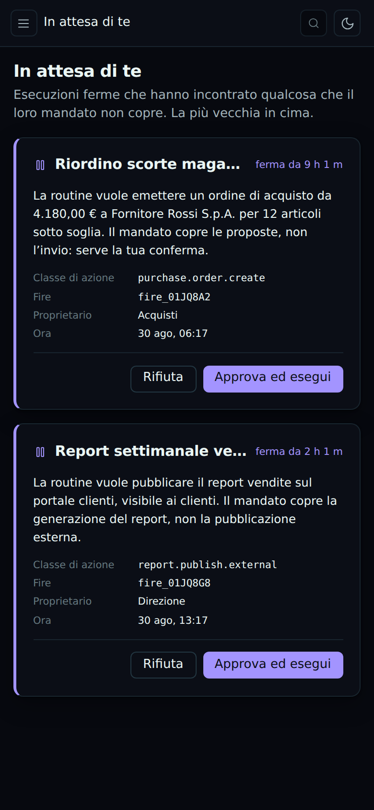 | 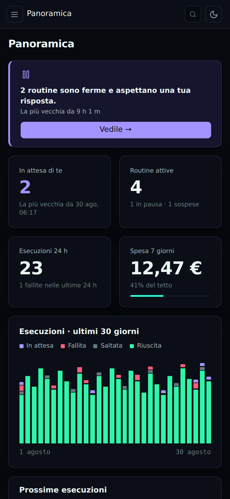 | 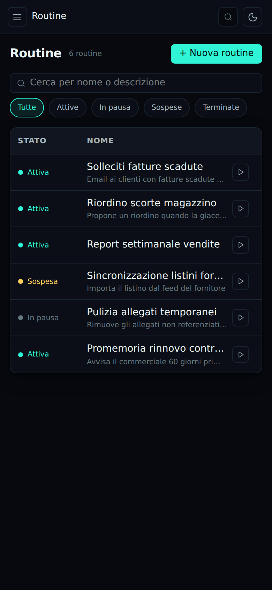 | 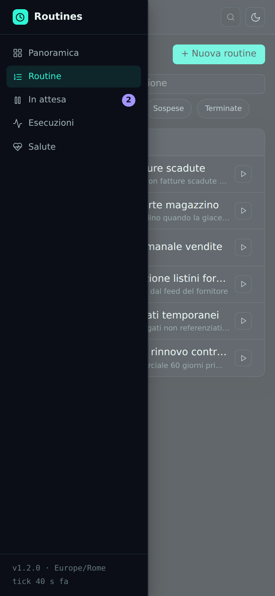 |
| "Is anything waiting on me?" | "Is everything running?" | Status, name, command. | The drawer navigation. |

The screenshots above are not a mockup: they come out of the compiled panel, the one the package
ships. And they earned their place. The first version of the mobile adaptation looked fine in every
test — the "run now" button existed in the DOM, it was clickable, every assertion on it passed — but
photographed it was **past the right edge of the screen**: `minmax(220px,1fr)` has a minimum that
does not yield, and it pushed everything after it off-screen. That is where the test measuring the
grid's incompressible width against a phone came from.

## Theme

Dark by default, light of equal standing. The `light` class on `<html>` is applied by the Blade view
**before the first paint** — applying it in React would mean a flash of the wrong theme on every
load. No component writes a literal colour: only tokens, defined in `@theme`, and every background
on a token has its matching text counterpart.

## Development

```bash
npm install
npm run dev          # Vite in watch mode
npm run typecheck    # TypeScript strict
npm test             # vitest
npm run build        # into public/, which is what the package ships

composer test        # pest
vendor/bin/pint --test
vendor/bin/phpstan analyse
```

The compiled assets are **committed**: whoever installs the package runs `vendor:publish` and has
the panel, with no need for Node.

## License

MIT © [Padosoft](https://padosoft.com)
